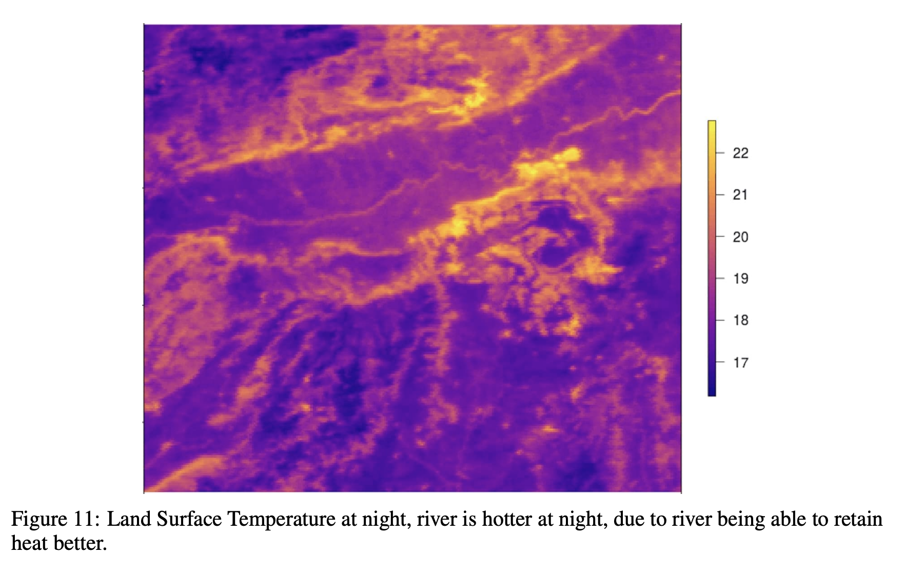

```{r setup, include=FALSE}
options(htmltools.dir.version = FALSE)
knitr::opts_chunk$set(echo = FALSE)
```

```{r xaringan-themer, include=FALSE, warning=FALSE}
library(xaringanthemer)
style_mono_light(
  base_color = "#23395b", 
  white_color = "white"
)
```

```{r xaringanExtra, echo=FALSE}
library(xaringanExtra)
use_fit_screen()
use_panelset()
use_logo(image_url = "img/logo_banner.jpeg", width = "180px", height = "120px")
```

```{r, load_refs, include=FALSE, cache=FALSE}
library(RefManageR)
BibOptions(check.entries = FALSE,
           bib.style = "authoryear",
           sorting = "none",
           cite.style = "authoryear",
           style = "markdown",
           hyperlink = FALSE,
           dashed = FALSE)
References <- ReadBib("VBagg_references.bib", check = TRUE)
```

.center[

### Plan for Today

]

.pull-left[

<br>

1. Aggregated Outputs
  
1. Gaussian Processes

1. Variational Inference

1. Examples and Discussion

<br>

```{r, fig.cap="Figure 3 from the paper"}

```
]

.pull-right[

```{r}

```

]

---
class: center, middle

# Aggregated Outputs

Main problem addressed by `r Citet(References, "VBAgg", .opts = list(max.names = 2))`

---

## Aggregated Outputs: Ex. Desease Prevalence

.pull-left[
```{r}

```
]

.pull-right[
```{r}

```
]

---

## Aggregated Outputs: Ex. Desease Prevalence

.pull-left[
```{r, out.width="80%", fig.cap="Figure 3(b)"}

```

Source: All three images from `r Citet(References, "VBAgg", .opts = list(max.names = 2))`.
]

.pull-right[
```{r, out.width="60%"}

```

```{r, out.width="60%"}

```
]

---

## Aggregated Outputs

.center[
```{r}

```
]

---

## Aggregated Outputs

.center[
```{r, out.width="60%"}

```
]

---

## Aggregated Outputs

.center[
```{r, out.width="60%"}

```
]

---

## Aggregated Outputs

.center[
```{r, out.width="60%"}

```
]

---

## Aggregated Outputs: Bag Observation Model

.panelset.sideways[
.panel[.panel-name[Data]

We have the following data

1. A **bag** of inputs $x^a = \lbrace x_1^a, x_2^a, \dots, x_{N_a}^a\rbrace$ coming from $N_a$ individuals

1. A total of $n$ such bags

1. For each bag we have its **aggregated output** $y^a$

Hence, our dataset is:

$$(\lbrace x_i^1 \rbrace_{i=1}^{N_1}, y^1)\;(\lbrace x_i^2 \rbrace_{i=1}^{N_2}, y^2)\;\cdots\;(\lbrace x_i^1 \rbrace_{i=1}^{N_n}, y^n)\;$$

]

.panel[.panel-name[Model]
The aggregated output is related to the bag via de following **Bag Observation Model**

$$y^a|x^a \sim p(y|\eta^a)$$ 
$$\eta^a := \sum_{i=1}^{N_a} w_i^a\;\eta(x_i^a)$$

where the $w_i$ represent (possible) fixed weights. The inference goal is on the individual *mean parameters* $\eta(x_i^a)$.  

]

.panel[.panel-name[Poisson Example]

- Suppose we have aggregated counts, 

- But we know the population sizes at the individual level $p_i^a$ (as well as other covariates $x$). Then, the bag population can be $p^a=\sum p_i^a$.

-We are interested in the individual rates $\lambda_i^a$ of the following Poisson model:

$$y^a|x^a \sim \text{Poisson}(p^a\lambda^a)$$ 
$$\lambda^a := \sum_{i=1}^{N_a} \dfrac{p_i^a}{p^a}\;\lambda(x_i^a)$$

]

.panel[.panel-name[But...]

#### Is it that simple?

- Non linear form of $\eta(x_i^a)$

- Usually *a lot* of individuals per bag 

#### What to do?

]

]


---
class: inverse, center, middle

# VBAgg 

## Variational Bag Aggregated Model with Gaussian Processes

`r Citet(References, "VBAgg", .opts = list(max.names = 2))`

---

## VBAgg

.panelset.sideways[

.panel[.panel-name[Poisson Example]

- Suppose we have aggregated counts, 

- But we know the population sizes at the individual level $p_i^a$ (as well as other covariates $x$). Then, the bag population can be $p^a=\sum p_i^a$.

-We are interested in the individual rates $\lambda_i^a$ of the following Poisson model:

$$y^a|x^a \sim \text{Poisson}(p^a\lambda^a)$$ 
$$\lambda^a := \sum_{i=1}^{N_a} \dfrac{p_i^a}{p^a}\;\lambda(x_i^a)$$

]

.panel[.panel-name[GP]

Model the complicated and unobserved relationship as a **Gaussian Process**

$$\lambda(x_i^a) = \Psi(f(x_i^a)) \qquad f\sim GP(\mu,k)$$

where $\Psi: \mathbb{R} \to \mathbb{R}^+$ is a suitable transformation like $\Psi(f) = \exp(f)$ or   $\Psi(f) = f^2$.

]

.panel[.panel-name[Inducing Points]

Since GP are complicated and we have many individuals, they propose also to consider some **inducing points** $\lbrace u_l\rbrace_{l=1}^m$, which are the evaluations of the process at *landmark points* $\lbrace z_l\rbrace_{l=1}^m$, so that

$$u_l := f(z_l),$$

so that

$$u \sim N_m(\mu_Z, K_{Z,Z})$$

]

.panel[.panel-name[Likelihood]

We are then interested in the following (log) likelihood:

$$\log p(Y) = \log \int\int p(Y, f, u) dfdu = \log \int\int \prod_{a=1}^n p(y^a|\eta^a)p(f | u) p(u)  df du$$

which is quite complicated, so they propose using **Variational Inference** to approximate it.

]

]

---
class: center, middle

# Gaussian Processes Detour

[`r Citet(References, "GPBetancourt", .opts = list(max.names = 2))`](https://betanalpha.github.io/assets/case_studies/gaussian_processes.html)


---
class: center, middle

# Variational Inference Detour

[`r Citet(References, "VariationalDeepBayes", .opts = list(max.names = 2))`](https://github.com/bayesgroup/deepbayes-2019/tree/master/lectures/day1)

---
class: center, middle

# Back to the Paper

[`r Citet(References, "VBAgg", .opts = list(max.names = 2))`](https://proceedings.neurips.cc/paper/2018/hash/24b43fb034a10d78bec71274033b4096-Abstract.html)

---
class: center, middle

# As for the code part...

[`r Citet(References, "VBRepo", .opts = list(max.names = 2))`](https://github.com/hcllaw/VBAgg)

---

# References

#### Main Paper and Repository
```{r, echo=FALSE, results="asis"}
PrintBibliography(References,start = 1, end = 2)
```

#### Detours
```{r, echo=FALSE, results="asis"}
PrintBibliography(References,start = 3, end = 4)
```